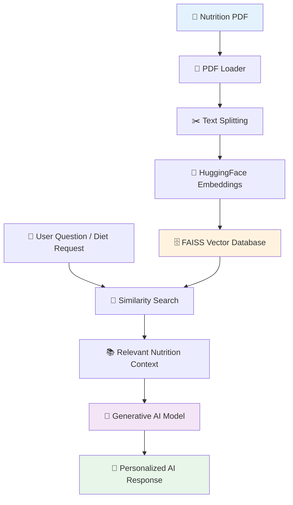
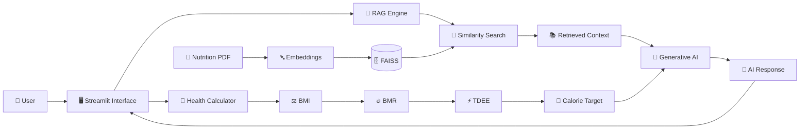
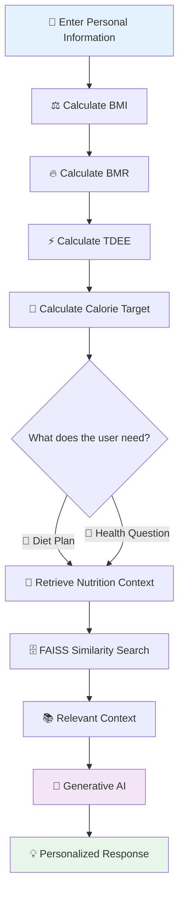

<div align="center">

# 🧠 AI Health Assistant

### AI-Powered Health, Nutrition & Personalized Diet Recommendation System

<p>
  <a href="https://project-health-assistant-manav.streamlit.app/">
    
  </a>
  <a href="https://github.com/techwithmanav/project-health-Assistant">
    
  </a>
</p>

<p>
  
  
  
  
  
  
</p>

<p>
  <strong>Calculate • Retrieve • Understand • Generate</strong>
</p>

<p>
  An intelligent wellness application that combines health calculations,
  nutrition knowledge retrieval, vector search, and Generative AI
  to provide personalized diet recommendations and nutrition assistance.
</p>

<br>

<a href="https://project-health-assistant-manav.streamlit.app/">
  
</a>

</div>

---

## 🌟 Overview

**AI Health Assistant** is an AI-powered wellness and nutrition application built with **Python and Streamlit**.

The system combines traditional health calculations with a **Retrieval-Augmented Generation (RAG)** pipeline to provide contextual AI-generated nutrition assistance.

Users can enter basic information such as:

* 👤 Age
* ⚧️ Gender
* ⚖️ Weight
* 📏 Height
* 🏃 Activity Level
* 🎯 Fitness Goal
* 🥗 Diet Preference
* ⚠️ Food Allergies

The application then calculates:

**BMI → BMR → TDEE → Estimated Calorie Target**

For AI-powered recommendations, the application retrieves relevant information from a nutrition knowledge base using **FAISS vector search** and provides the retrieved context to the AI model before generating a response.

---

# 🚀 Live Application

<div align="center">

<a href="https://project-health-assistant-manav.streamlit.app/">

</a>

<br><br>

**Live Demo**

https://project-health-assistant-manav.streamlit.app/

</div>

---

# ✨ Key Features

<table>
<tr>
<td width="50%">

### 🧮 Health Calculations

* ⚖️ BMI Calculation
* 🔥 BMR Estimation
* ⚡ TDEE Calculation
* 🎯 Calorie Target Estimation

</td>

<td width="50%">

### 🤖 AI Assistance

* 💬 Health & Nutrition Q&A
* 🥗 AI Diet Recommendations
* 🧠 Generative AI
* 🔎 Context-Aware Responses

</td>
</tr>

<tr>
<td>

### 🧠 RAG Pipeline

* 📄 Nutrition PDF Knowledge Base
* ✂️ Document Chunking
* 🔤 Embeddings
* 🗄️ FAISS Vector Database
* 🔎 Similarity Search

</td>

<td>

### 🥗 Personalized Nutrition

* 👤 User Profile Inputs
* 🥦 Vegetarian / Non-Vegetarian
* ⚠️ Allergy Awareness
* 🍽️ One-Day Meal Plan
* 📊 Approximate Nutrition Information

</td>
</tr>
</table>

---

# 🧠 How the AI Works

The core intelligence of the project is built around **Retrieval-Augmented Generation (RAG)**.

Instead of relying only on the language model's internal knowledge, the application first searches a nutrition knowledge base and retrieves relevant information.

### 🔄 RAG Architecture



### 🔍 RAG Process

```text
Nutrition Knowledge
       │
       ▼
   PDF Loading
       │
       ▼
 Text Extraction
       │
       ▼
 Text Chunking
       │
       ▼
   Embeddings
       │
       ▼
 FAISS Vector DB
       │
       ▼
 User Question
       │
       ▼
Similarity Search
       │
       ▼
Relevant Context
       │
       ▼
  Generative AI
       │
       ▼
Personalized Answer
```

---

# 🏗️ System Architecture



---

# 🧮 Health Calculation Engine

The application performs a sequence of health-related calculations.

### Calculation Flow

```text
👤 User Information
        │
        ▼
📏 Height + ⚖️ Weight
        │
        ▼
⚖️ BMI
        │
        ▼
👤 Age + Gender + Height + Weight
        │
        ▼
🔥 BMR
        │
        ▼
🏃 Activity Level
        │
        ▼
⚡ TDEE
        │
        ▼
🎯 Fitness Goal
        │
        ▼
🍽️ Estimated Calorie Target
```

### Supported Calculations

| Calculation           | Purpose                        |
| --------------------- | ------------------------------ |
| ⚖️ **BMI**            | Body Mass Index                |
| 🔥 **BMR**            | Basal Metabolic Rate           |
| ⚡ **TDEE**            | Total Daily Energy Expenditure |
| 🎯 **Calorie Target** | Estimated daily calorie target |

---

# 🥗 Personalized Diet Recommendation

The application uses the user's provided information to generate a personalized one-day meal recommendation.

### Input

```text
👤 Gender
🎂 Age
⚖️ Weight
📏 Height
🏃 Activity Level
🎯 Health Goal
🥗 Diet Type
⚠️ Food Allergies
```

### Output

```text
🍳 Breakfast
        ↓
🥜 Morning Snack
        ↓
🍛 Lunch
        ↓
🍎 Evening Snack
        ↓
🍽️ Dinner
```

The generated recommendations can include:

* 🍽️ Food suggestions
* 📏 Portion information
* 🔥 Approximate calories
* 💪 Approximate protein
* ⚠️ Allergy-aware considerations

---

# 💬 Health & Nutrition Assistant

Users can also ask nutrition-related questions.

### Example Questions

```text
"What are good sources of vegetarian protein?"

"What are healthy breakfast options?"

"How can I increase my protein intake?"

"What foods are rich in nutrients?"

"What are some healthy sources of carbohydrates?"
```

### Response Pipeline

```text
💬 User Question
       ↓
🔎 FAISS Similarity Search
       ↓
📚 Relevant Nutrition Context
       ↓
🤖 Generative AI
       ↓
💡 Context-Aware Answer
```

---

# 🛠️ Technology Stack

<div align="center">

| Layer               | Technology                                         |
| ------------------- | -------------------------------------------------- |
| 🐍 Programming      | **Python**                                         |
| 🖥️ Web Interface   | **Streamlit**                                      |
| 🤖 AI / LLM         | **Hugging Face Router + OpenAI-compatible SDK**    |
| 🧠 Model            | **openai/gpt-oss-120b**                            |
| 🔎 RAG              | **LangChain**                                      |
| 🗄️ Vector Database | **FAISS**                                          |
| 🔤 Embeddings       | **HuggingFace Embeddings / Sentence Transformers** |
| 📄 PDF Processing   | **PyPDF**                                          |
| 🔐 Configuration    | **python-dotenv**                                  |
| ☁️ Deployment       | **Streamlit Community Cloud**                      |

</div>

---

# 📂 Project Structure

```text
project-health-Assistant/
│
├── 📄 app.py
│   └── Main Streamlit application
│
├── 📄 diet.py
│   └── BMI, BMR, TDEE & calorie calculations
│
├── 📄 rag.py
│   └── RAG creation and retrieval logic
│
├── 📄 create_database.py
│   └── FAISS vector database creation
│
├── 📄 llm_test.py
│   └── LLM testing
│
├── 📄 requirements.txt
│   └── Python dependencies
│
├── 📄 LICENSE
│
├── 📁 data/
│   └── 📄 nutrition.pdf
│
└── 📄 README.md
```

---

# ⚙️ Installation & Setup

## 1️⃣ Clone the Repository

```bash
git clone https://github.com/techwithmanav/project-health-Assistant.git
cd project-health-Assistant
```

## 2️⃣ Create a Virtual Environment

### Windows

```bash
python -m venv venv
```

Activate:

```bash
venv\Scripts\activate
```

### macOS / Linux

```bash
python3 -m venv venv
source venv/bin/activate
```

---

## 3️⃣ Install Dependencies

```bash
pip install -r requirements.txt
```

---

## 4️⃣ Configure Environment Variables

Create a `.env` file:

```env
HF_TOKEN=your_hugging_face_token
```

⚠️ **Never upload your `.env` file or API credentials to GitHub.**

---

# 🗄️ Build the Vector Database

Make sure the nutrition knowledge file exists:

```text
data/nutrition.pdf
```

Then run:

```bash
python create_database.py
```

This creates the local FAISS vector database used by the RAG pipeline.

---

# ▶️ Run Locally

Start the Streamlit application:

```bash
python -m streamlit run app.py
```

Open:

```text
http://localhost:8501
```

---

# ☁️ Deployment

The application is deployed using **Streamlit Community Cloud**.

### Deployment Flow

```text
💻 GitHub Repository
        │
        ▼
☁️ Streamlit Community Cloud
        │
        ▼
📦 Install Dependencies
        │
        ▼
🔐 Configure Secrets
        │
        ▼
🚀 Deploy Application
        │
        ▼
🌐 Live Web Application
```

### Live Deployment

🚀 **https://project-health-assistant-manav.streamlit.app/**

---

# 🔐 Security

API credentials should never be hard-coded into the application.

### ❌ Avoid

```python
HF_TOKEN = "my-secret-token"
```

### ✅ Use environment variables / Streamlit secrets

```python
st.secrets["HF_TOKEN"]
```

or:

```python
from dotenv import load_dotenv
import os

load_dotenv()

HF_TOKEN = os.getenv("HF_TOKEN")
```

Recommended `.gitignore` entries:

```text
.env
venv/
.venv/
__pycache__/
*.py[cod]
.streamlit/secrets.toml
*.log
```

---

# 📊 Application Workflow



---

# 🎯 Project Objectives

This project demonstrates practical implementation of:

* 🐍 Python application development
* 🖥️ Streamlit web applications
* 🧮 Mathematical health calculations
* 🤖 Generative AI integration
* 🧠 Retrieval-Augmented Generation
* 🔎 Semantic similarity search
* 🗄️ Vector databases
* 🔤 Text embeddings
* 📄 PDF knowledge retrieval
* 🔐 Environment-based secret management
* ☁️ Cloud deployment

---

# 💡 What Makes This Project Interesting?

The project combines multiple modern AI application concepts into one working application:

```text
              ┌──────────────────────┐
              │      Streamlit       │
              │      Web App         │
              └──────────┬───────────┘
                         │
              ┌──────────▼───────────┐
              │  Health Calculations │
              │ BMI • BMR • TDEE     │
              └──────────┬───────────┘
                         │
              ┌──────────▼───────────┐
              │        RAG            │
              │ Retrieval + Context  │
              └──────────┬───────────┘
                         │
              ┌──────────▼───────────┐
              │       FAISS           │
              │    Vector Search      │
              └──────────┬───────────┘
                         │
              ┌──────────▼───────────┐
              │    Generative AI      │
              │   Context-Aware LLM   │
              └──────────┬───────────┘
                         │
              ┌──────────▼───────────┐
              │ Personalized Output  │
              └──────────────────────┘
```

---

# 🔮 Future Improvements

Potential future enhancements include:

* 🔐 User authentication
* ☁️ Cloud-based persistent database
* 📅 Weekly meal planning
* 📆 Monthly meal planning
* 📈 Health progress tracking
* ⚖️ Weight tracking
* 📊 Nutrition visualization
* 🛒 Grocery list generation
* 📄 Downloadable diet plans
* 🌐 Multilingual support
* 📱 Improved mobile experience
* 🔔 Personalized reminders
* 🧠 Improved RAG evaluation
* 🛡️ Additional validation and safety checks

---

# ⚠️ Health & Safety Disclaimer

> **This application is intended for educational and general wellness purposes only.**

The information generated by this application should **not** be considered a substitute for professional medical advice, diagnosis, or treatment.

This application should not be used to:

* Diagnose medical conditions
* Prescribe medication
* Replace professional medical consultation
* Claim that a particular food or diet can cure a disease

For serious or persistent health concerns, consult a qualified healthcare professional.

---

# 👨‍💻 Developer

<div align="center">

## Manav Chaudhary

**CSE Student | Python Developer | AI & Generative AI Learner**

### Currently Exploring

🐍 Python
⚡ Full Stack Development
🤖 Generative AI
🧠 Retrieval-Augmented Generation
🖥️ Streamlit

<br>

<a href="https://github.com/techwithmanav">

</a>

</div>

---

# 📈 GitHub Profile

<div align="center">


<br><br>


<br><br>


</div>
----

<div align="center">

### 🧠 AI Health Assistant

**Built with Python • Streamlit • RAG • FAISS • Generative AI**

<br>

🚀 **Live Demo:**
https://project-health-assistant-manav.streamlit.app/

<br>

💻 **Source Code:**
https://github.com/techwithmanav/project-health-Assistant

<br><br>

**Made with ❤️ by Manav Chaudhary**

</div>
